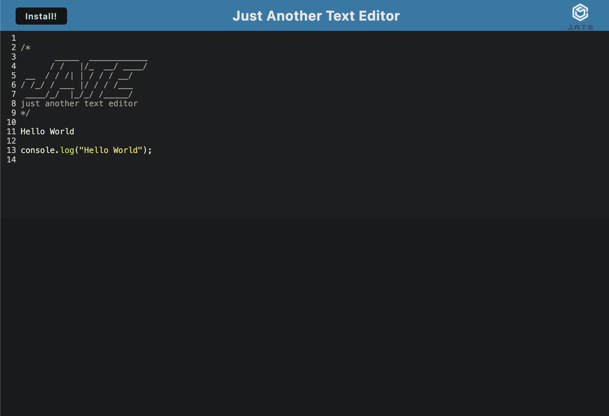

# Basic Text Editor

## Description

This project is a text editor that functions in the browser and offline. This single page app is modeled as a Progressive Web Application. The text is maintained in an IndexedDB and kept when transfering to the app from the browser.

## Installation

To run this application locally, first download the repository and open in your preferred code editor. Run `npm install` to download the necessary npm package dependencies, found in the package.json. The necessary dependencies can be found listed in the package.json. Finally, start the application by running the command `npm run start`.

## Usage

The deployed application can be found [here](https://browser-text-52b8a642b9b8.herokuapp.com/).

Type any code block or other notes in the text editor. Any typed content will be saved in the IndexedDB when the window is unfocused or clicked off of. This saved data can be viewed in the browser's dev tools. When you reopen the text editor after closing it, the content in the text editor will be retrieved from the IndexedDB.

If the Install button is clicked, the web application will be downloaded as an icon in your desktop. The downloaded application works without an internet connection, following the functionality of a PWA(progressive web application).

## Credits

Source code was obtained from [The Coding Bootcamp](https://github.com/coding-boot-camp/cautious-meme)

## License

MIT License

## Contributing Guidelines

Please contact me through [email](mailto:paigehcarroll@gmail.com) or via [my Github page](https://github.com/sillytsundere) if you'd like to critique or contribute.
